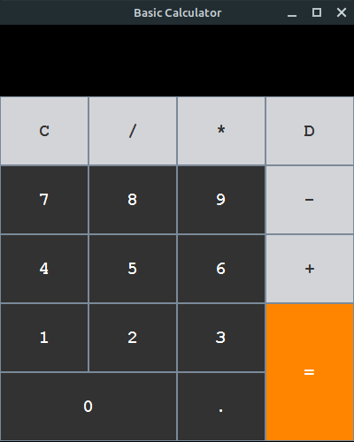

# Java GUI Calculator
A calculator made using Java Swing for a school project.

## Usage
1. Download the .jar file or clone this repo.
2. If you have Java installed, you can run the following command: `java -jar Calculator.jar`
